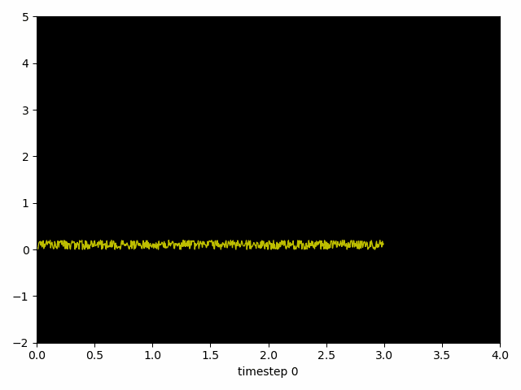

# neuro-gifs

Project to create neuroscience-related gifs.

Everything runs in a Conda environment as defined by `env.yml`.

You may have to add the root location to your `PYTHONPATH`.

Neuron spiking time series
---

NifTi gifs
---

